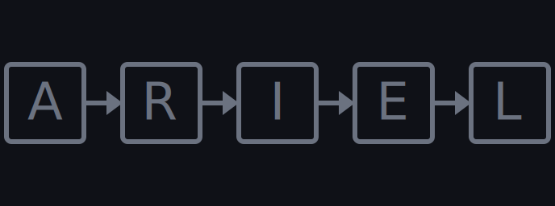

# ariel

<p align="center"></p>

A tool for LLMs to explain complex systems to humans. Using ariel, LLMs can generate step-by-step Mermaid diagram walkthroughs. The walkthrough breaks a system down into comprehensible chunks. Output formats include interactive self-contained HTML (best experience), interactive SVG (for embedding in GitHub PRs and READMEs), or MP4 (non-interactive). Additionally, you can "watch" a file which your agent updates as it codes.

Actual example SVGs below

[](examples/example-output/ariel-why-output.svg)

[](examples/example-output/ariel-what-output.svg)

## Install

**Go install**
```sh
go install github.com/scottrogowski/ariel@latest
```

MP4 output requires [`ffmpeg`](https://ffmpeg.org/download.html) on your `PATH`.

## Usage

The best way to use Ariel is to ask your agent to `go install github.com/scottrogowski/ariel@latest` and "use this tool to create a walkthrough to explain this code/system/PR/concept.

Common commands
```sh
# Load the DSL reference into LLM context (agents are expected to run this first)
ariel guide

# Lint a walkthrough file
ariel verify my-system.ariel.yaml

# Live-reloading browser preview while editing
ariel watch my-system.ariel.yaml

# Render to a self-contained HTML file
ariel generate my-system.ariel.yaml

# Render to interactive SVG (for embedding in GitHub PRs and READMEs)
ariel generate --format svg my-system.ariel.yaml
```

## Developing

AGENTS: Ariel follows spec-driven-development. Read spec/ariel-spec.md now. This is NOT optional. The spec MUST be kept in sync with all source changes.

## Testing

AGENTS: do this after every change

```sh
make test
make lint
make example  # generates HTML, SVG, and MP4 outputs under examples/example-output/
```

Important: Automated tests cover parsing, verification, and CLI behavior. Visual output correctness — node highlighting, edge animation, layout, SVG interactivity, etc — cannot be tested automatically. After any change to the renderer or template, open the generated HTML and SVG in a browser and inspect the MP4 to verify.
