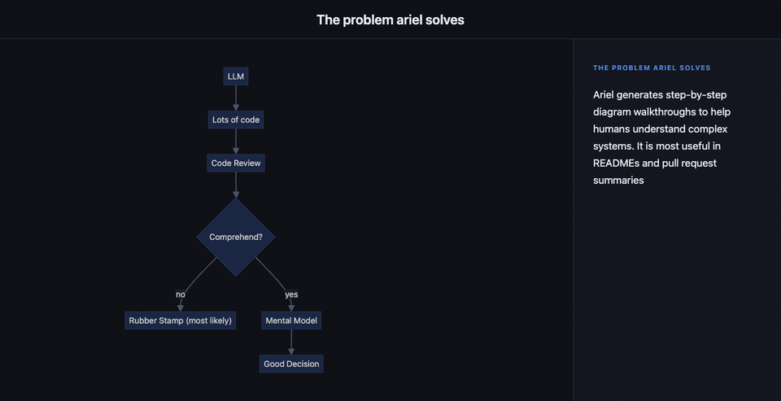
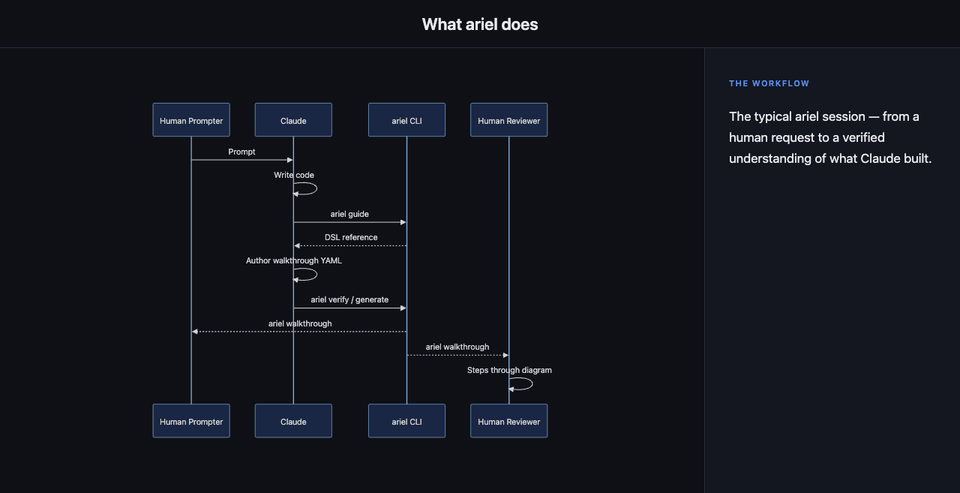

# ariel

<p align="center"></p>

CLI tool to generate step-by-step Mermaid diagram walkthroughs. Each walkthrough pairs a diagram with a sequence of steps that highlight nodes, animate edges, and narrate what is happening. Outputs HTML (interactive), MP4, and GIF (for embedding in GitHub READMEs and PR descriptions). Primarily designed as a tool for LLMs.





Run `ariel guide` at the start of a session to load the full DSL into context.

## Install

**Go install**
```sh
go install github.com/scottmrogowski/ariel@latest
```

**Pre-built binaries** — download from [Releases](https://github.com/scottmrogowski/ariel/releases) and put the binary on your `PATH`.

MP4 output requires [`ffmpeg`](https://ffmpeg.org/download.html) on your `PATH`.

## Usage

```sh
# Load the DSL reference into LLM context (run this first when using an agent)
ariel guide

# Lint a walkthrough file
ariel verify my-system.ariel.yaml

# Live-reloading browser preview while editing
ariel watch my-system.ariel.yaml

# Render to a self-contained HTML file
ariel generate my-system.ariel.yaml

# Render to gif (for GitHub README embedding)
ariel generate --format gif my-system.ariel.yaml
```

## Developing

AGENTS: Ariel follows spec-driven-development. Read spec/ariel-spec.md now. This is NOT optional. The spec MUST be kept in sync with all source changes.

## Testing

```sh
make test     # unit tests
make example  # generates HTML, MP4, and GIF outputs under examples/
```

Automated tests cover parsing, verification, and CLI behavior. Visual output correctness — node highlighting, edge animation, layout, and video/GIF playback — cannot be tested automatically. After any change to the renderer or template, open the generated HTML in a browser and inspect the GIF to verify. A human must do this.
