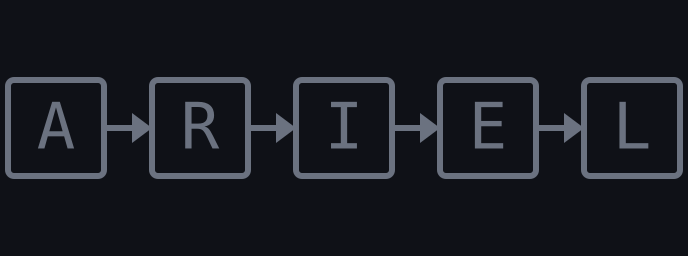

<p align="center"></p>

Ariel is a CLI and plugin for creating guided Mermaid walkthroughs. It enables LLMs to teach humans unfamiliar software systems/concepts and quickly build useful mental models.

Ariel walkthroughs simplify otherwise complex systems/ideas into comprehensible chunks. Output formats include interactive:
- self-contained HTML (best experience)
- interactive SVG (for embedding in GitHub PRs and READMEs)
- MP4

Ariel's most powerful command is `ariel watch`. This allows your agent to iteratively update a file which Ariel then re-renders in your browser.

_If a picture is worth 1000 words, is a walkthrough worth 10,000?_

## Examples

[Interactive HTML walkthrough](https://scottrogowski.github.io/ariel/)

[](https://raw.githubusercontent.com/scottrogowski/ariel/refs/heads/main/examples/example-output/what-is-ariel.svg)

[](https://raw.githubusercontent.com/scottrogowski/ariel/refs/heads/main/examples/example-output/how-ariel-works.svg)

## Install

**Claude plugin (recommended)**

Gives your agent the `ariel` command and teaches it the workflow in one step:
```sh
/plugin marketplace add scottrogowski/ariel
/plugin install ariel
```

**Codex plugin (recommended)**

```sh
codex plugin marketplace add scottrogowski/ariel
codex plugin add ariel@ariel
```

**Go install**
```sh
go install github.com/scottrogowski/ariel/cmd/ariel@latest
```
The `~/go/bin` directory is usually not on Claude's path so if you install this way, Claude will need to search for Ariel

**Notes**

MP4 output requires [`ffmpeg`](https://ffmpeg.org/download.html).

Windows is not supported at this time.

## Usage

Prompt your agent:

> Create a walkthrough with the `ariel` CLI to explain this [code/system/PR/concept].

Common commands
```sh
# Print the DSL reference (the create-walkthrough skill also carries it inline)
ariel guide

# Lint a walkthrough file
ariel verify my-system.ariel.yaml

# Live-reloading browser preview while editing
ariel watch my-system.ariel.yaml

# Render to a self-contained HTML file
ariel generate my-system.ariel.yaml

# Render to interactive SVG (for embedding in GitHub PRs and READMEs)
ariel generate --format svg my-system.ariel.yaml

# Force a color theme (auto, the default, follows the OS in HTML)
ariel generate --theme light my-system.ariel.yaml
```

## Development

Ariel follows spec-driven-development. Read spec/ariel-spec.md. If you are an agent, read this NOW. This is NOT optional. The spec MUST be kept in sync with all source changes.

After every code change that could alter the output rendering (which is almost every code change), run `make examples`. This is also NOT optional. Almost every commit should have modifications to the examples.

Set `.claude-plugin/plugin.json` to the next release version in every pull request. `make reconcile` copies it to the Codex manifest. Minor releases add features. Patch releases contain only fixes or aesthetic updates. Merging to `main` publishes the matching Git tag, GitHub Release, and binaries.

## Testing

```sh
make test
make lint
make examples
```

AGENTS: Tests do not cover most visual output. Your changes must be manually validated by you or the user. Use `chrome-devtools` if you have access. Use `/tmp` for temporary artifacts, not the repo root. If you do not have access to `chrome-devtools`, remind the user that they must manually validate before finalizing changes.

HUMANS: Please manually validate the output before opening PRs.
